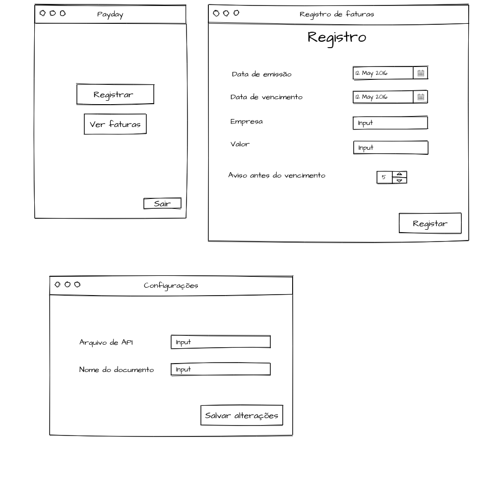
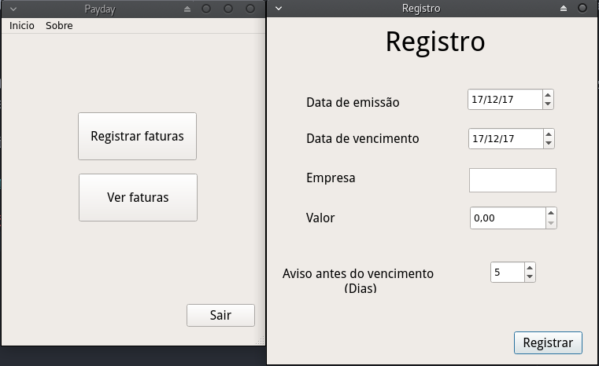
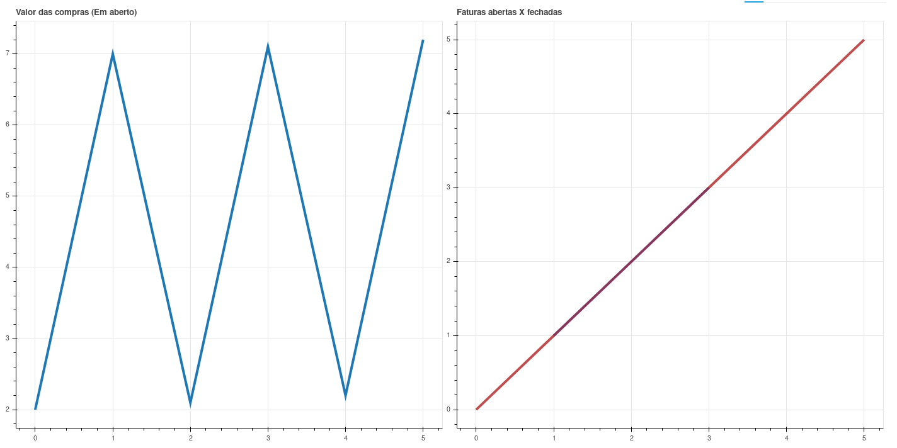

## Payday

Programa para facilitar o gerenciamento de suas faturas, evitando atrasos.

### Objetivo

Criei este aplicativo para me auxiliar a manter todas as minhas faturas em ordem, de uma forma personalizada para meu uso.

## Ideia base

A ideia é bastante simples, aqui farei a utilização do Google SpreadSheets, para o armazenamento das informações, e de um bot do telegram, para auxiliar as notificações

Imagem da ideia inicial das primeiras interfaces

## Já implementado

* Registro de fatura;
* Confirmação de pagamento da fatura;
* Configuração via menu da API do Google.

### Demonstração

Abaixo algumas janelas do projeto já criadas

Janela dos gráficos gerados pelo aplicativo (Este pode ser visualizado em <code>Exemplos</code>)

## Google API

Para que o programa funcione corretamente é necessário que o usuário configure uma API para acesso aos documentos do Google. Para realizar este processo é bastante simples, basta acessar o painel de APIs do Google, criar um novo projeto, e então, criar as credênciais para este aplicativo acessar.

OBS: Também será necessário criar uma planilha e informar o nome desta nas configurações do programa.

Caso tenha alguma dúvida acesse: https://goo.gl/JxKuec, neste link os passos para configurar a API são realizados.
