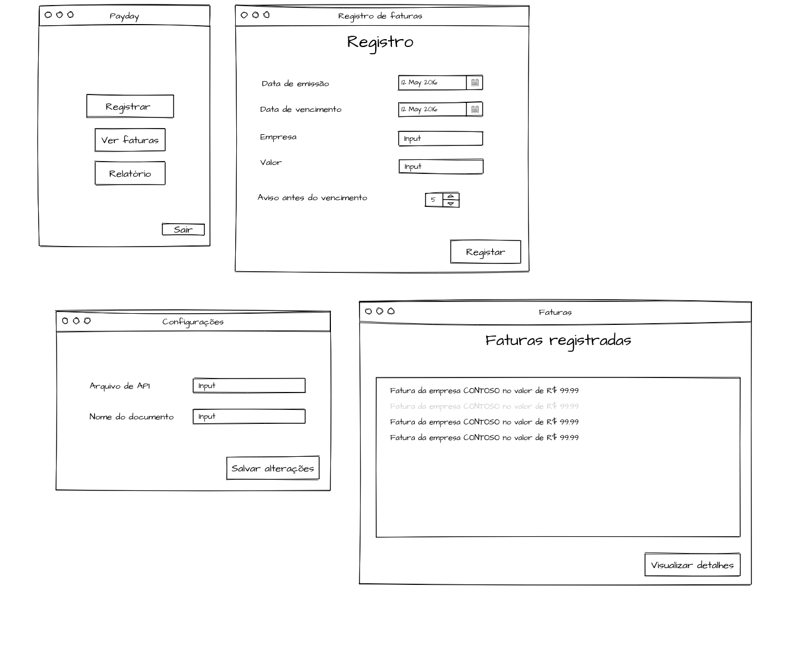
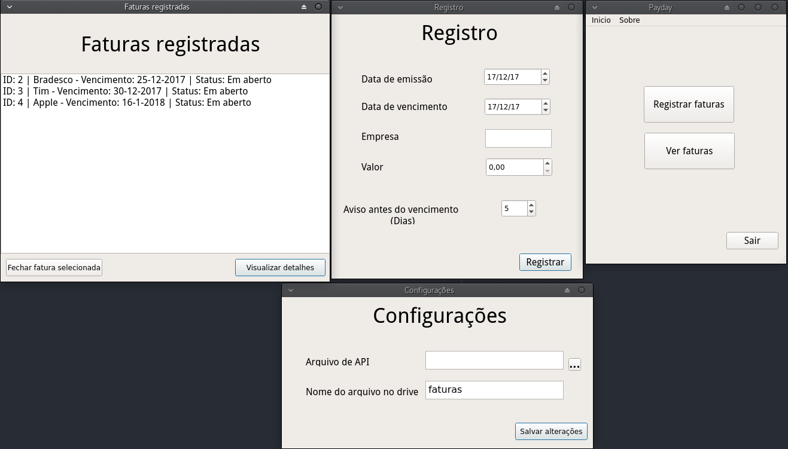

## Payday

Programa para facilitar o gerenciamento de suas faturas, evitando atrasos.

### Objetivo

Criei este aplicativo para me auxiliar a manter todas as minhas faturas em ordem, de uma forma personalizada para meu uso.

## Ideia base

A ideia é bastante simples, aqui farei a utilização do Google SpreadSheets, para o armazenamento das informações, e de um bot do telegram, para auxiliar as notificações

Imagem da ideia inicial das primeiras interfaces

## Demonstrações

Abaixo algumas demonstrações das janelas do projeto já criadas

## Google API

Para que este programa funcione é necessário, utilizar o Google Drive API, para isso acesse o console de APIs, criei um novo projeto, gere uma credencial de acesso, o arquivo de autenticação gerado deverá ter seu conteudo salvo dentro do arquivo **client_secret.json**.

Não esqueça de criar um projeto que recebe chamadas de um servidor WEB, e ainda que suas chamadas sejam para armazenamento.
